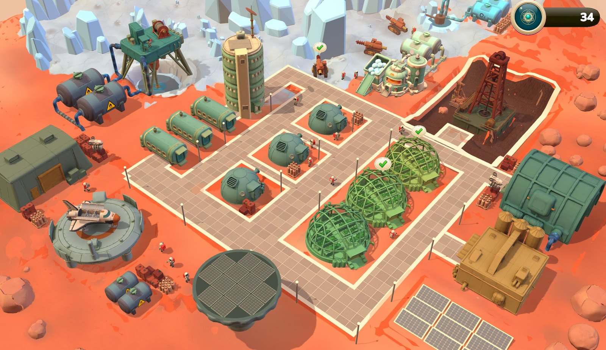
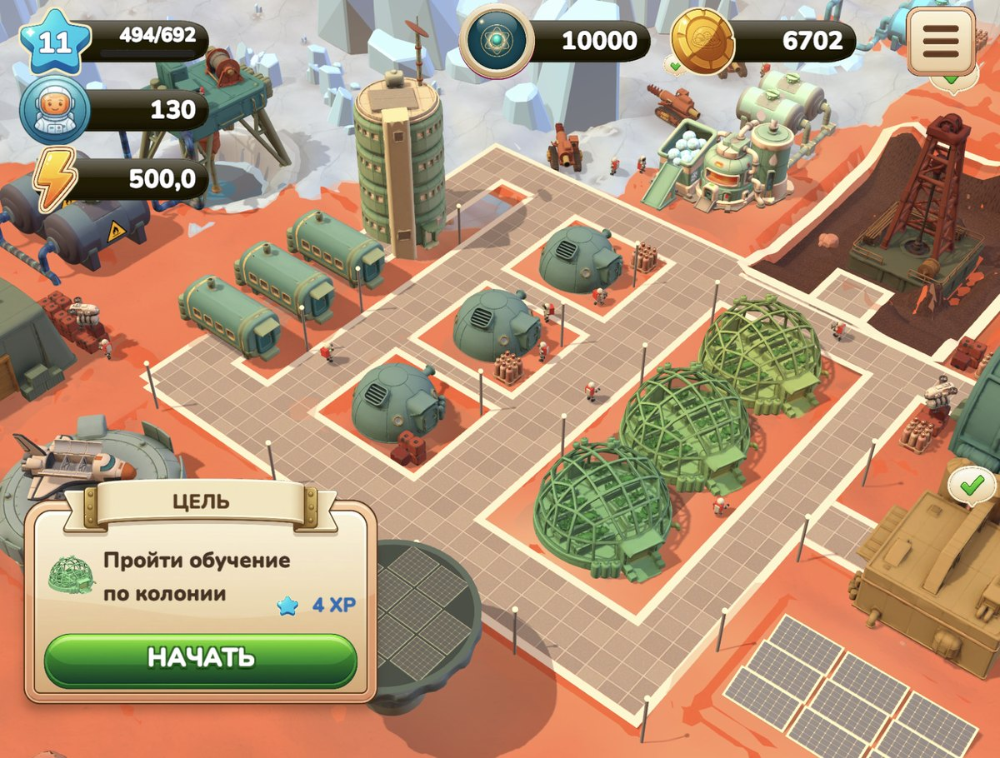
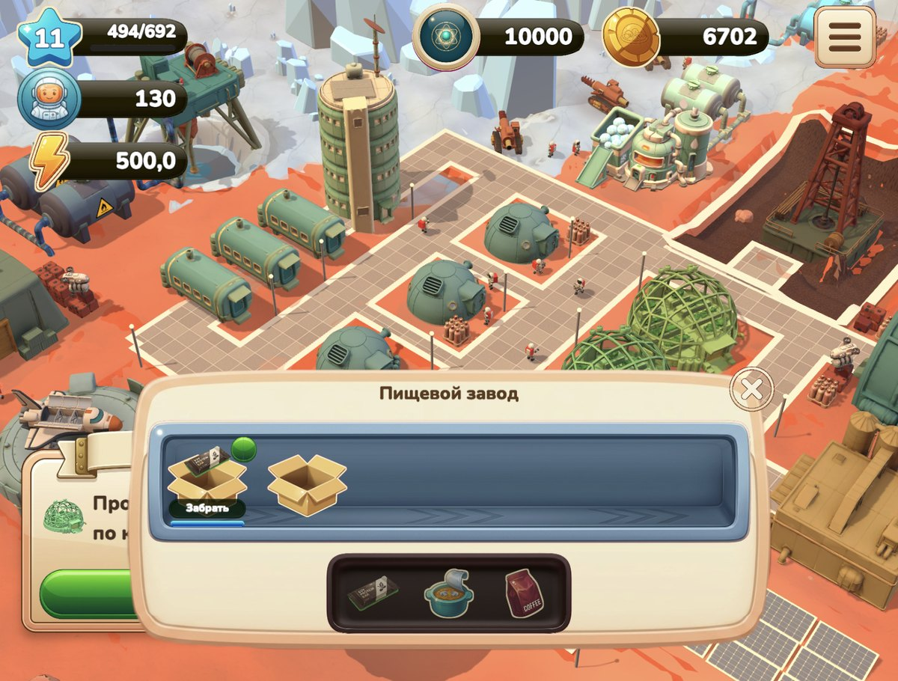

<h1 align="center">Mars Colony</h1>

<p align="center">
Казуальный сити-билдер про колонию на Марсе. Unity 6, играется в браузере.
</p>

<p align="center">
  <a href="https://amirkhan06.itch.io/mars-colony"></a>
  
  
</p>

<p align="center">
  
</p>

<table>
  <tr>
    <td></td>
    <td></td>
  </tr>
</table>

Грядки, переработка, склад, дрон-курьер и грузовой шаттл. Жанр и петля взяты у
Township намеренно, свое здесь в связке трех транспортных механик и в экономике
под нее.

Проект собран одним человеком с конца июля 2026 года. Я не программист и не
художник: код, модели и иконки сделаны ИИ-инструментами. Моя часть работы это
ТЗ, числа экономики, критерии приемки и отбраковка того, что им не прошло.

| Что | Сколько |
|---|---|
| ТЗ механик и каркас экономики | 9 документов, около 5 000 строк |
| Код игры на C# | около 15 700 строк |
| Доменная логика и симулятор на TypeScript | около 11 200 строк |
| Автотесты, гейт на каждом коммите | 642 |

## Что где лежит

| Папка | Что внутри |
|---|---|
| `unity/` | Игра на Unity 6: сцена, код, интерфейс, модели. Это то, что открывается по ссылке выше |
| `src/` | Веб-прототип на TypeScript: доменная логика, балансный симулятор, тесты |
| `docs/specs/` | ТЗ механик и каркас экономики |
| `design/` | Референсы, промпты генерации, модели, ТЗ шаттла в .docx |
| `loop/` | Журнал работы: отчеты витков, вердикты критиков, разборы ошибок |
| `orchestrator/` | Текущий план: видение и спека выхода на Яндекс Игры |

## ТЗ

Начинать с `docs/specs/mars-colony-frame.md`. Это каркас: валюты, инварианты,
роли механик. Все остальные ТЗ ссылаются на него, а при противоречии прав каркас.

- `mini-tz-shattl-v2.md` разворачивает шаттл до реализуемой спеки: состояния,
  экраны, числа, открытые вопросы с владельцем и датой.
- `tz-production-mars.md`, `tz-drone-mars.md`, `tz-liner-mars.md` описывают
  остальные механики, `tz-common-systems-mars.md` общие системы: генератор
  заказов, ускорение, события аналитики.
- `tz-rebalans-ekonomiki.md` появился после замера живой сборки. Выяснилось,
  что выгоднее всего засеять все соей и ничего не строить. ТЗ чинит числа и
  ставит тест, который ловит возврат этой стратегии.

Это копия от 6 октября 2026 года. Рабочие версии ведутся в личной базе знаний,
ссылки вида `[[имя]]` указывают на соседние документы оттуда.

## Как устроен код

Доменный слой не знает об интерфейсе. Игровые числа живут в одном месте,
`src/domain/config/`, и приходят туда из каркаса. Симулятор вызывает те же
функции, что и игра, поэтому баланс проверяется на настоящей логике, а не на
таблице рядом с ней.

Unity-версия повторяет домен на C# (`unity/Assets/Scripts/Domain`). Тест
`cs-mirror-drift` сверяет числа C# с TypeScript, чтобы две версии не считали
разные игры.

Тесты, которые стоит открыть первыми:

- `src/domain/__tests__/invariants.test.ts`: инварианты каркаса, каждый тест
  ссылается на номер инварианта;
- `generator-shape.property.test.ts`: тест-свойство на `fast-check`, перебирает
  уровни, наборы построек и наполнение склада;
- `spec-drift.test.ts`: падает, если параметр из ТЗ не найден в коде и не
  записан в отложенное с причиной;
- `balance-metric.test.ts`: тот самый сторож из ТЗ ребаланса.

Хук на коммит гоняет формат, типы и тесты, красное не коммитится. Тесты, которые
доказывают еще не починенный дефект, называются `defects-*` и в гейт не входят.

## Запуск

Веб-прототип, нужен Node 22+:

```
npm install
npm run dev      # прототип в браузере
npm run sim      # симулятор: три профиля игрока, 30 дней игры
npm run check    # формат, типы, тесты с покрытием
npm run e2e      # браузерные проверки, Playwright
```

На чистой машине `check` пропустит две сверки: с рабочими ТЗ и с Unity-кодом.
Они читают соседние папки, которых в клоне нет, и печатают об этом
предупреждение. Остальные тесты идут как обычно.

Unity-версия: открыть папку `unity/` в Unity Hub, редактор 6000.0.64f1, сцена
`Assets/Scenes/MAIN.unity`. Первое открытие пересобирает кэш, это несколько
минут. Сборка для браузера из командной строки:

```
Unity.exe -batchmode -quit -projectPath unity -executeMethod MarsColony.EditorTools.SborkaWeb.Sobrat -logFile build.log
```

Тесты домена на C# лежат в `unity/Assets/Editor/Tests/Domain`, запускаются из
Test Runner в режиме EditMode.

Папка `unity/` это снимок рабочего Unity-проекта на 6 октября 2026 года. Историю
коммитов Unity-проекта сюда не перенес: в ней резервные копии сцен по 300-400 МБ,
GitHub такие файлы не принимает.

## Чужие ассеты

- Модели: [KayKit Space Base Bits](https://kaylousberg.itch.io/space-base-bits)
  и [Kenney Space Kit](https://kenney.nl/assets/space-kit), обе CC0.
- Шрифты: Nunito (SIL OFL), Roboto Mono (Apache 2.0).
- Музыка: Space Ambient, автор SolarFLEX, Pixabay Content License.

Лицензии лежат рядом с файлами в `unity/Assets`.
